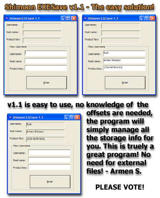



## Shimoon EXESave v1\.1

### Description

ALL NEW VERSION!!! Stores 3 textboxes in the actual exe file! Can be more data if code altered slightly! No need to know the offsets now either! If you guys would be nice as to PLEASE VOTE FOR THIS!!! It wasn't very easy to find a solution to the problem of excess files - and I found it! So please be nice - vote and leave comments!
 
### More Info
 

             |
---                |---
**Submitted On**   |2001-11-18 20:57:26
**By**             |[Armen Shimoon](https://github.com/Planet-Source-Code/PSCIndex/blob/master/ByAuthor/armen-shimoon.md)
**Level**          |Intermediate
**User Rating**    |4.4 (48 globes from 11 users)
**Compatibility**  |VB 5\.0, VB 6\.0
**Category**       |[Files/ File Controls/ Input/ Output](https://github.com/Planet-Source-Code/PSCIndex/blob/master/ByCategory/files-file-controls-input-output__1-3.md)
**World**          |[Visual Basic](https://github.com/Planet-Source-Code/PSCIndex/blob/master/ByWorld/visual-basic.md)
**Archive File**   |[Shimoon\_EX3600311182001\.zip](https://github.com/Planet-Source-Code/armen-shimoon-shimoon-exesave-v1-1__1-29001/archive/master.zip)

